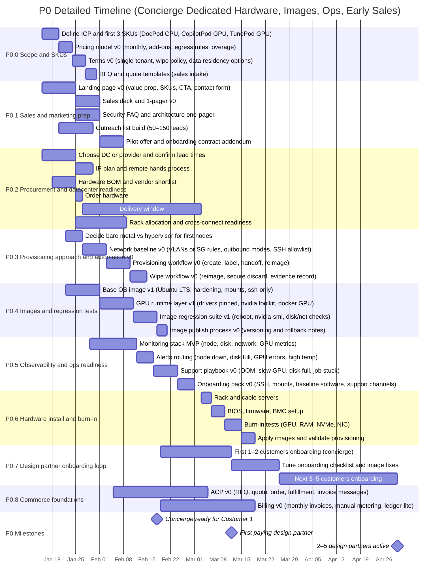

```mermaid
gantt
    title P0 Detailed Timeline (Concierge Dedicated Hardware, Images, Ops, Early Sales)
    dateFormat YYYY-MM-DD
    axisFormat %b %d

    section P0.0 Scope and SKUs
        Define ICP and first 3 SKUs (DocPod CPU, CopilotPod GPU, TunePod GPU): p00a, 2026-01-15, 5d
        Pricing model v0 (monthly, add-ons, egress rules, overage): p00b, after p00a, 4d
        Terms v0 (single-tenant, wipe policy, data residency options): p00c, after p00b, 4d
        RFQ and quote templates (sales intake): p00d, after p00c, 3d

    section P0.1 Sales and marketing prep
        Landing page v0 (value prop, SKUs, CTA, contact form): p01a, 2026-01-15, 10d
        Sales deck and 1-pager v0: p01b, after p01a, 7d
        Security FAQ and architecture one-pager: p01c, after p01a, 7d
        Outreach list build (50–150 leads): p01d, 2026-01-20, 10d
        Pilot offer and onboarding contract addendum: p01e, after p01b, 7d

    section P0.2 Procurement and datacenter readiness
        Choose DC or provider and confirm lead times: p02a, 2026-01-15, 10d
        IP plan and remote hands process: p02b, after p02a, 5d
        Hardware BOM and vendor shortlist: p02c, 2026-01-18, 7d
        Order hardware: p02d, after p02c, 2d
        Delivery window: p02e, after p02d, 35d
        Rack allocation and cross-connect readiness: p02f, 2026-01-25, 15d

    section P0.3 Provisioning approach and automation v0
        Decide bare metal vs hypervisor for first nodes: p03a, 2026-01-22, 5d
        Network baseline v0 (VLANs or SG rules, outbound modes, SSH allowlist): p03b, after p03a, 7d
        Provisioning workflow v0 (create, label, handoff, reimage): p03c, after p03b, 7d
        Wipe workflow v0 (reimage, secure discard, evidence record): p03d, after p03c, 5d

    section P0.4 Images and regression tests
        Base OS image v1 (Ubuntu LTS, hardening, mounts, ssh-only): p04a, 2026-01-22, 10d
        GPU runtime layer v1 (drivers pinned, nvidia toolkit, docker GPU): p04b, after p04a, 10d
        Image regression suite v1 (reboot, nvidia-smi, disk/net checks): p04c, after p04b, 7d
        Image publish process v0 (versioning and rollback notes): p04d, after p04c, 3d

    section P0.5 Observability and ops readiness
        Monitoring stack MVP (node, disk, network, GPU metrics): p05a, 2026-01-29, 14d
        Alerts routing (node down, disk full, GPU errors, high temp): p05b, after p05a, 5d
        Support playbook v0 (OOM, slow GPU, disk full, job stuck): p05c, after p05b, 7d
        Onboarding pack v0 (SSH, mounts, baseline software, support channels): p05d, after p05c, 5d

    section P0.6 Hardware install and burn-in
        Rack and cable servers: p06a, after p02e, 3d
        BIOS, firmware, BMC setup: p06b, after p06a, 4d
        Burn-in tests (GPU, RAM, NVMe, NIC): p06c, after p06b, 5d
        Apply images and validate provisioning: p06d, after p06c, 4d

    section P0.7 Design partner onboarding loop
        First 1–2 customers onboarding (concierge): p07a, 2026-02-19, 21d
        Tune onboarding checklist and image fixes: p07b, after p07a, 14d
        Next 3–5 customers onboarding: p07c, after p07b, 35d

    section P0.8 Commerce foundations
        ACP v0 (RFQ, quote, order, fulfillment, invoice messages): p08a, 2026-02-05, 28d
        Billing v0 (monthly invoices, manual metering, ledger-lite): p08b, 2026-02-19, 28d

    section P0 Milestones
        Concierge ready for Customer 1: milestone, after p04c, 0d
        First paying design partner: milestone, after p07a, 0d
        2–5 design partners active: milestone, after p07c, 0d

```