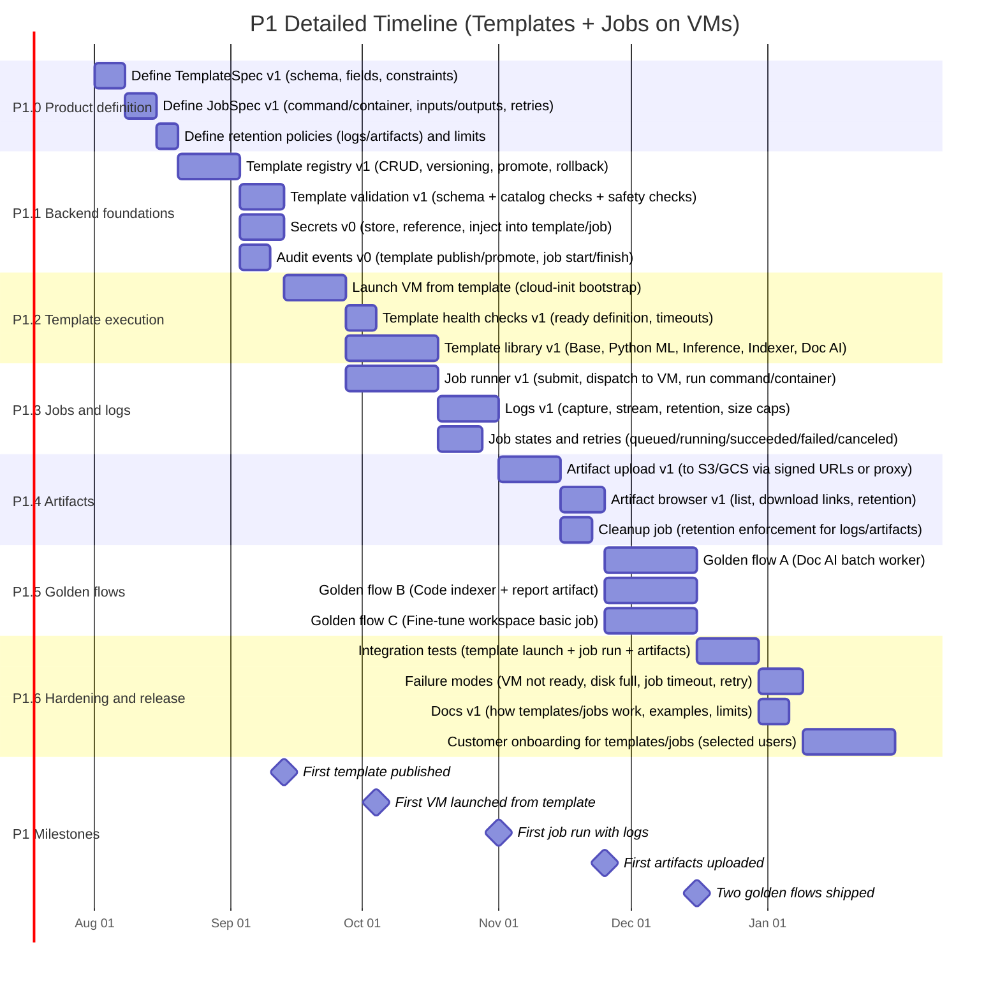

```mermaid
gantt
    title P1 Detailed Timeline (Templates + Jobs on VMs)
    dateFormat YYYY-MM-DD
    axisFormat %b %d

    section P1.0 Product definition
        Define TemplateSpec v1 (schema, fields, constraints): p1a, 2026-08-01, 7d
        Define JobSpec v1 (command/container, inputs/outputs, retries): p1b, after p1a, 7d
        Define retention policies (logs/artifacts) and limits: p1c, after p1b, 5d

    section P1.1 Backend foundations
        Template registry v1 (CRUD, versioning, promote, rollback): p1d, after p1c, 14d
        Template validation v1 (schema + catalog checks + safety checks): p1e, after p1d, 10d
        Secrets v0 (store, reference, inject into template/job): p1f, after p1d, 10d
        Audit events v0 (template publish/promote, job start/finish): p1g, after p1d, 7d

    section P1.2 Template execution
        Launch VM from template (cloud-init bootstrap): p1h, after p1e, 14d
        Template health checks v1 (ready definition, timeouts): p1i, after p1h, 7d
        Template library v1 (Base, Python ML, Inference, Indexer, Doc AI): p1j, after p1h, 21d

    section P1.3 Jobs and logs
        Job runner v1 (submit, dispatch to VM, run command/container): p1k, after p1h, 21d
        Logs v1 (capture, stream, retention, size caps): p1l, after p1k, 14d
        Job states and retries (queued/running/succeeded/failed/canceled): p1m, after p1k, 10d

    section P1.4 Artifacts
        Artifact upload v1 (to S3/GCS via signed URLs or proxy): p1n, after p1l, 14d
        Artifact browser v1 (list, download links, retention): p1o, after p1n, 10d
        Cleanup job (retention enforcement for logs/artifacts): p1p, after p1n, 7d

    section P1.5 Golden flows
        Golden flow A (Doc AI batch worker): p1q, after p1o, 21d
        Golden flow B (Code indexer + report artifact): p1r, after p1o, 21d
        Golden flow C (Fine-tune workspace basic job): p1s, after p1o, 21d

    section P1.6 Hardening and release
        Integration tests (template launch + job run + artifacts): p1t, after p1q, 14d
        Failure modes (VM not ready, disk full, job timeout, retry): p1u, after p1t, 10d
        Docs v1 (how templates/jobs work, examples, limits): p1v, after p1t, 7d
        Customer onboarding for templates/jobs (selected users): p1w, after p1u, 21d

    section P1 Milestones
        First template published: milestone, after p1e, 0d
        First VM launched from template: milestone, after p1i, 0d
        First job run with logs: milestone, after p1l, 0d
        First artifacts uploaded: milestone, after p1o, 0d
        Two golden flows shipped: milestone, after p1r, 0d
```