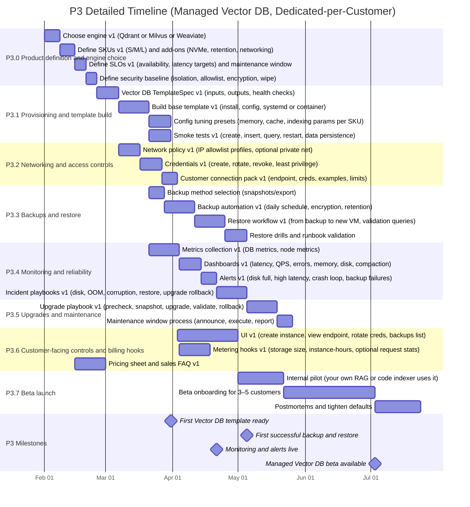

```mermaid
gantt
    title P3 Detailed Timeline (Managed Vector DB, Dedicated-per-Customer)
    dateFormat YYYY-MM-DD
    axisFormat %b %d

    section P3.0 Product definition and engine choice
        Choose engine v1 (Qdrant or Milvus or Weaviate): p3a, 2027-02-01, 7d
        Define SKUs v1 (S/M/L) and add-ons (NVMe, retention, networking): p3b, after p3a, 7d
        Define SLOs v1 (availability, latency targets) and maintenance window: p3c, after p3b, 5d
        Define security baseline (isolation, allowlist, encryption, wipe): p3d, after p3c, 5d

    section P3.1 Provisioning and template build
        Vector DB TemplateSpec v1 (inputs, outputs, health checks): p3e, after p3d, 10d
        Build base template v1 (install, config, systemd or container): p3f, after p3e, 14d
        Config tuning presets (memory, cache, indexing params per SKU): p3g, after p3f, 10d
        Smoke tests v1 (create, insert, query, restart, data persistence): p3h, after p3f, 10d

    section P3.2 Networking and access controls
        Network policy v1 (IP allowlist profiles, optional private net): p3i, after p3e, 10d
        Credentials v1 (create, rotate, revoke, least privilege): p3j, after p3i, 10d
        Customer connection pack v1 (endpoint, creds, examples, limits): p3k, after p3j, 7d

    section P3.3 Backups and restore
        Backup method selection (snapshots/export): p3l, after p3f, 7d
        Backup automation v1 (daily schedule, encryption, retention): p3m, after p3l, 14d
        Restore workflow v1 (from backup to new VM, validation queries): p3n, after p3m, 14d
        Restore drills and runbook validation: p3o, after p3n, 10d

    section P3.4 Monitoring and reliability
        Metrics collection v1 (DB metrics, node metrics): p3p, after p3f, 14d
        Dashboards v1 (latency, QPS, errors, memory, disk, compaction): p3q, after p3p, 10d
        Alerts v1 (disk full, high latency, crash loop, backup failures): p3r, after p3q, 7d
        Incident playbooks v1 (disk, OOM, corruption, restore, upgrade rollback): p3s, after p3r, 14d

    section P3.5 Upgrades and maintenance
        Upgrade playbook v1 (precheck, snapshot, upgrade, validate, rollback): p3t, after p3o, 14d
        Maintenance window process (announce, execute, report): p3u, after p3t, 7d

    section P3.6 Customer-facing controls and billing hooks
        UI v1 (create instance, view endpoint, rotate creds, backups list): p3v, after p3k, 28d
        Metering hooks v1 (storage size, instance-hours, optional request stats): p3w, after p3p, 14d
        Pricing sheet and sales FAQ v1: p3x, after p3b, 14d

    section P3.7 Beta launch
        Internal pilot (your own RAG or code indexer uses it): p3y, after p3v, 21d
        Beta onboarding for 3–5 customers: p3z, after p3y, 42d
        Postmortems and tighten defaults: p3aa, after p3z, 21d

    section P3 Milestones
        First Vector DB template ready: milestone, after p3h, 0d
        First successful backup and restore: milestone, after p3o, 0d
        Monitoring and alerts live: milestone, after p3r, 0d
        Managed Vector DB beta available: milestone, after p3z, 0d
```