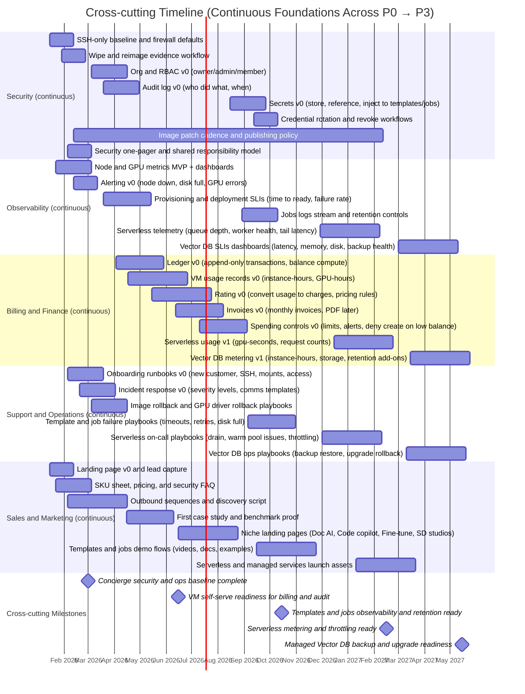

```mermaid
gantt
    title Cross-cutting Timeline (Continuous Foundations Across P0 → P3)
    dateFormat YYYY-MM-DD
    axisFormat %b %Y

    section Security (continuous)
        SSH-only baseline and firewall defaults: sec1, 2026-01-15, 4w
        Wipe and reimage evidence workflow: sec2, 2026-01-29, 4w
        Org and RBAC v0 (owner/admin/member): sec3, 2026-03-05, 6w
        Audit log v0 (who did what, when): sec4, 2026-03-19, 6w
        Secrets v0 (store, reference, inject to templates/jobs): sec5, 2026-08-15, 6w
        Credential rotation and revoke workflows: sec6, 2026-09-12, 4w
        Image patch cadence and publishing policy: sec7, 2026-02-12, 52w
        Security one-pager and shared responsibility model: sec8, 2026-02-05, 4w

    section Observability (continuous)
        Node and GPU metrics MVP + dashboards: obs1, 2026-01-22, 6w
        Alerting v0 (node down, disk full, GPU errors): obs2, 2026-02-12, 4w
        Provisioning and deployment SLIs (time to ready, failure rate): obs3, 2026-03-19, 8w
        Jobs logs stream and retention controls: obs4, 2026-08-29, 6w
        Serverless telemetry (queue depth, worker health, tail latency): obs5, 2026-11-29, 10w
        Vector DB SLIs dashboards (latency, memory, disk, backup health): obs6, 2027-03-01, 10w

    section Billing and Finance (continuous)
        Ledger v0 (append-only transactions, balance compute): bill1, 2026-04-03, 8w
        VM usage records v0 (instance-hours, GPU-hours): bill2, 2026-04-17, 10w
        Rating v0 (convert usage to charges, pricing rules): bill3, 2026-05-15, 10w
        Invoices v0 (monthly invoices, PDF later): bill4, 2026-06-12, 8w
        Spending controls v0 (limits, alerts, deny create on low balance): bill5, 2026-07-10, 8w
        Serverless usage v1 (gpu-seconds, request counts): bill6, 2026-12-15, 10w
        Vector DB metering v1 (instance-hours, storage, retention add-ons): bill7, 2027-03-15, 10w

    section Support and Operations (continuous)
        Onboarding runbooks v0 (new customer, SSH, mounts, access): ops1, 2026-02-05, 6w
        Incident response v0 (severity levels, comms templates): ops2, 2026-02-19, 6w
        Image rollback and GPU driver rollback playbooks: ops3, 2026-03-05, 6w
        Template and job failure playbooks (timeouts, retries, disk full): ops4, 2026-09-05, 8w
        Serverless on-call playbooks (drain, warm pool issues, throttling): ops5, 2026-12-01, 10w
        Vector DB ops playbooks (backup restore, upgrade rollback): ops6, 2027-03-10, 10w

    section Sales and Marketing (continuous)
        Landing page v0 and lead capture: mkt1, 2026-01-15, 4w
        SKU sheet, pricing, and security FAQ: mkt2, 2026-01-22, 6w
        Outbound sequences and discovery script: mkt3, 2026-02-05, 10w
        First case study and benchmark proof: mkt4, 2026-04-15, 8w
        Niche landing pages (Doc AI, Code copilot, Fine-tune, SD studios): mkt5, 2026-06-15, 10w
        Templates and jobs demo flows (videos, docs, examples): mkt6, 2026-09-15, 10w
        Serverless and managed services launch assets: mkt7, 2027-01-10, 10w

    section Cross-cutting Milestones
        Concierge security and ops baseline complete: milestone, 2026-03-01, 0d
        VM self-serve readiness for billing and audit: milestone, 2026-06-15, 0d
        Templates and jobs observability and retention ready: milestone, 2026-10-15, 0d
        Serverless metering and throttling ready: milestone, 2027-02-15, 0d
        Managed Vector DB backup and upgrade readiness: milestone, 2027-05-15, 0d
```