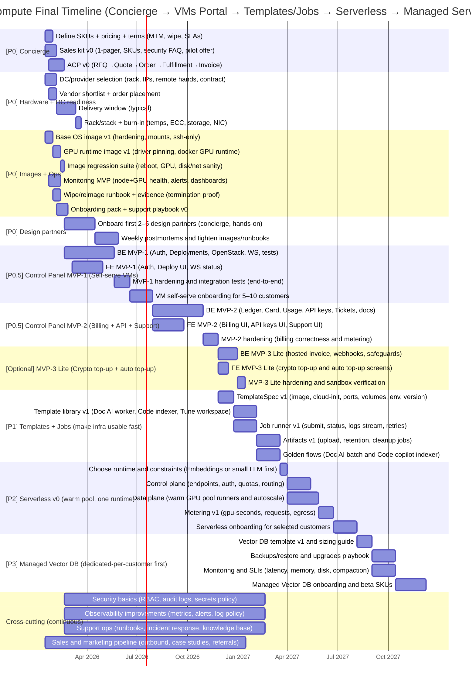

```mermaid
gantt
    title AI-Compute Final Timeline (Concierge → VMs Portal → Templates/Jobs → Serverless → Managed Services)
    dateFormat YYYY-MM-DD
    axisFormat %b %Y

    section [P0] Concierge
        Define SKUs + pricing + terms (MTM, wipe, SLAs): p0a, 2026-01-15, 14d
        Sales kit v0 (1-pager, SKUs, security FAQ, pilot offer): p0b, 2026-01-15, 21d
        ACP v0 (RFQ→Quote→Order→Fulfillment→Invoice): p0c, 2026-01-22, 28d

    section [P0] Hardware + DC readiness
        DC/provider selection (rack, IPs, remote hands, contract): p0d, 2026-01-15, 21d
        Vendor shortlist + order placement: p0e, 2026-01-22, 14d
        Delivery window (typical): p0f, after p0e, 35d
        Rack/stack + burn-in (temps, ECC, storage, NIC): p0g, after p0f, 10d

    section [P0] Images + Ops
        Base OS image v1 (hardening, mounts, ssh-only): p0h, 2026-01-15, 14d
        GPU runtime image v1 (driver pinning, docker GPU runtime): p0i, after p0h, 14d
        Image regression suite (reboot, GPU, disk/net sanity): p0j, after p0i, 7d
        Monitoring MVP (node+GPU health, alerts, dashboards): p0k, 2026-01-22, 21d
        Wipe/reimage runbook + evidence (termination proof): p0l, 2026-01-29, 14d
        Onboarding pack + support playbook v0: p0m, 2026-02-05, 21d

    section [P0] Design partners
        Onboard first 2–5 design partners (concierge, hands-on): p0n, 2026-02-19, 56d
        Weekly postmortems and tighten images/runbooks: p0o, after p0n, 42d

    section [P0.5] Control Panel MVP-1 (Self-serve VMs)
        BE MVP-1 (Auth, Deployments, OpenStack, WS, tests): m1be, 2026-02-19, 91d
        FE MVP-1 (Auth, Deploy UI, WS status): m1fe, 2026-03-05, 56d
        MVP-1 hardening and integration tests (end-to-end): m1qa, after m1be, 28d
        VM self-serve onboarding for 5–10 customers: m1on, after m1qa, 42d

    section [P0.5] Control Panel MVP-2 (Billing + API + Support)
        BE MVP-2 (Ledger, Card, Usage, API keys, Tickets, docs): m2be, after m1on, 91d
        FE MVP-2 (Billing UI, API keys UI, Support UI): m2fe, after m1on, 56d
        MVP-2 hardening (billing correctness and metering): m2qa, after m2be, 28d

    section [Optional] MVP-3 Lite (Crypto top-up + auto top-up)
        BE MVP-3 Lite (hosted invoice, webhooks, safeguards): m3be, after m2qa, 35d
        FE MVP-3 Lite (crypto top-up and auto top-up screens): m3fe, after m2qa, 18d
        MVP-3 Lite hardening and sandbox verification: m3qa, after m3be, 14d

    section [P1] Templates + Jobs (make infra usable fast)
        TemplateSpec v1 (image, cloud-init, ports, volumes, env, version): t1, after m2qa, 28d
        Template library v1 (Doc AI worker, Code indexer, Tune workspace): t2, after t1, 42d
        Job runner v1 (submit, status, logs stream, retries): t3, after t1, 42d
        Artifacts v1 (upload, retention, cleanup jobs): t4, after t3, 42d
        Golden flows (Doc AI batch and Code copilot indexer): t5, after t2, 42d

    section [P2] Serverless v0 (warm pool, one runtime)
        Choose runtime and constraints (Embeddings or small LLM first): s0, after t4, 14d
        Control plane (endpoints, auth, quotas, routing): s1, after s0, 42d
        Data plane (warm GPU pool runners and autoscale): s2, after s0, 56d
        Metering v1 (gpu-seconds, requests, egress): s3, after s2, 28d
        Serverless onboarding for selected customers: s4, after s3, 42d

    section [P3] Managed Vector DB (dedicated-per-customer first)
        Vector DB template v1 and sizing guide: v1, after s4, 28d
        Backups/restore and upgrades playbook: v2, after v1, 42d
        Monitoring and SLIs (latency, memory, disk, compaction): v3, after v1, 42d
        Managed Vector DB onboarding and beta SKUs: v4, after v2, 56d

    section Cross-cutting (continuous)
        Security basics (RBAC, audit logs, secrets policy): c1, 2026-02-19, 365d
        Observability improvements (metrics, alerts, log policy): c2, 2026-02-19, 365d
        Support ops (runbooks, incident response, knowledge base): c3, 2026-02-19, 365d
        Sales and marketing pipeline (outbound, case studies, referrals): c4, 2026-01-15, 365d
```