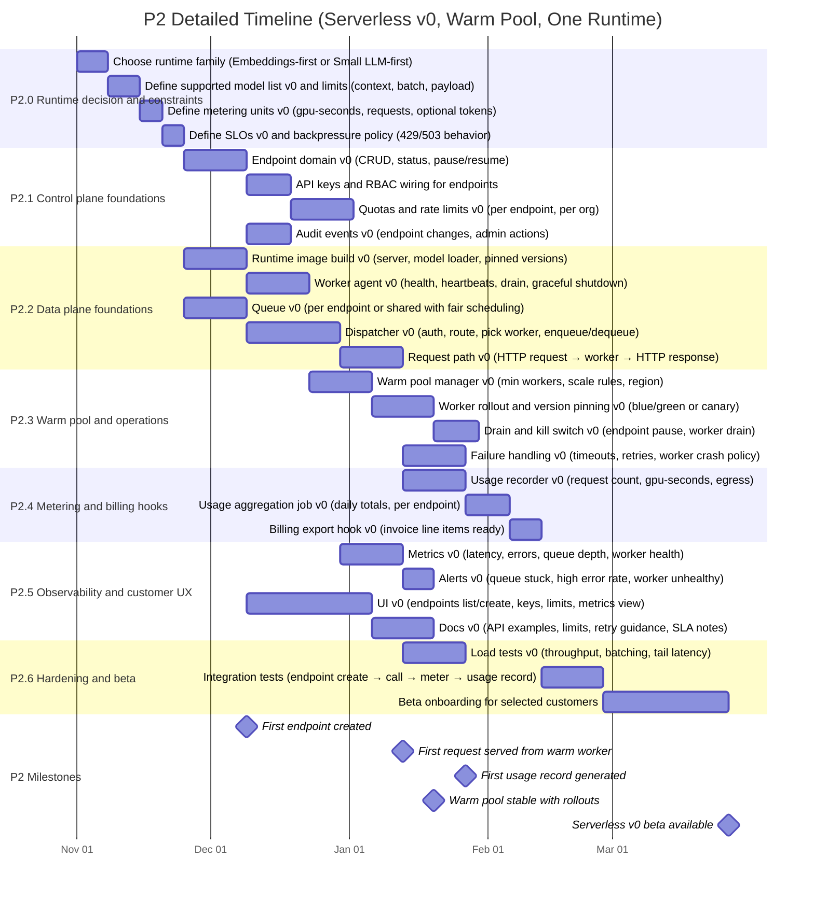

```mermaid
gantt
    title P2 Detailed Timeline (Serverless v0, Warm Pool, One Runtime)
    dateFormat YYYY-MM-DD
    axisFormat %b %d

    section P2.0 Runtime decision and constraints
        Choose runtime family (Embeddings-first or Small LLM-first): p2a, 2026-11-01, 7d
        Define supported model list v0 and limits (context, batch, payload): p2b, after p2a, 7d
        Define metering units v0 (gpu-seconds, requests, optional tokens): p2c, after p2b, 5d
        Define SLOs v0 and backpressure policy (429/503 behavior): p2d, after p2c, 5d

    section P2.1 Control plane foundations
        Endpoint domain v0 (CRUD, status, pause/resume): p2e, after p2d, 14d
        API keys and RBAC wiring for endpoints: p2f, after p2e, 10d
        Quotas and rate limits v0 (per endpoint, per org): p2g, after p2f, 14d
        Audit events v0 (endpoint changes, admin actions): p2h, after p2e, 10d

    section P2.2 Data plane foundations
        Runtime image build v0 (server, model loader, pinned versions): p2i, after p2d, 14d
        Worker agent v0 (health, heartbeats, drain, graceful shutdown): p2j, after p2i, 14d
        Queue v0 (per endpoint or shared with fair scheduling): p2k, after p2d, 14d
        Dispatcher v0 (auth, route, pick worker, enqueue/dequeue): p2l, after p2k, 21d
        Request path v0 (HTTP request → worker → HTTP response): p2m, after p2l, 14d

    section P2.3 Warm pool and operations
        Warm pool manager v0 (min workers, scale rules, region): p2n, after p2j, 14d
        Worker rollout and version pinning v0 (blue/green or canary): p2o, after p2n, 14d
        Drain and kill switch v0 (endpoint pause, worker drain): p2p, after p2o, 10d
        Failure handling v0 (timeouts, retries, worker crash policy): p2q, after p2m, 14d

    section P2.4 Metering and billing hooks
        Usage recorder v0 (request count, gpu-seconds, egress): p2r, after p2m, 14d
        Usage aggregation job v0 (daily totals, per endpoint): p2s, after p2r, 10d
        Billing export hook v0 (invoice line items ready): p2t, after p2s, 7d

    section P2.5 Observability and customer UX
        Metrics v0 (latency, errors, queue depth, worker health): p2u, after p2l, 14d
        Alerts v0 (queue stuck, high error rate, worker unhealthy): p2v, after p2u, 7d
        UI v0 (endpoints list/create, keys, limits, metrics view): p2w, after p2e, 28d
        Docs v0 (API examples, limits, retry guidance, SLA notes): p2x, after p2w, 14d

    section P2.6 Hardening and beta
        Load tests v0 (throughput, batching, tail latency): p2y, after p2u, 14d
        Integration tests (endpoint create → call → meter → usage record): p2z, after p2t, 14d
        Beta onboarding for selected customers: p2aa, after p2z, 28d

    section P2 Milestones
        First endpoint created: milestone, after p2e, 0d
        First request served from warm worker: milestone, after p2m, 0d
        First usage record generated: milestone, after p2r, 0d
        Warm pool stable with rollouts: milestone, after p2o, 0d
        Serverless v0 beta available: milestone, after p2aa, 0d
```