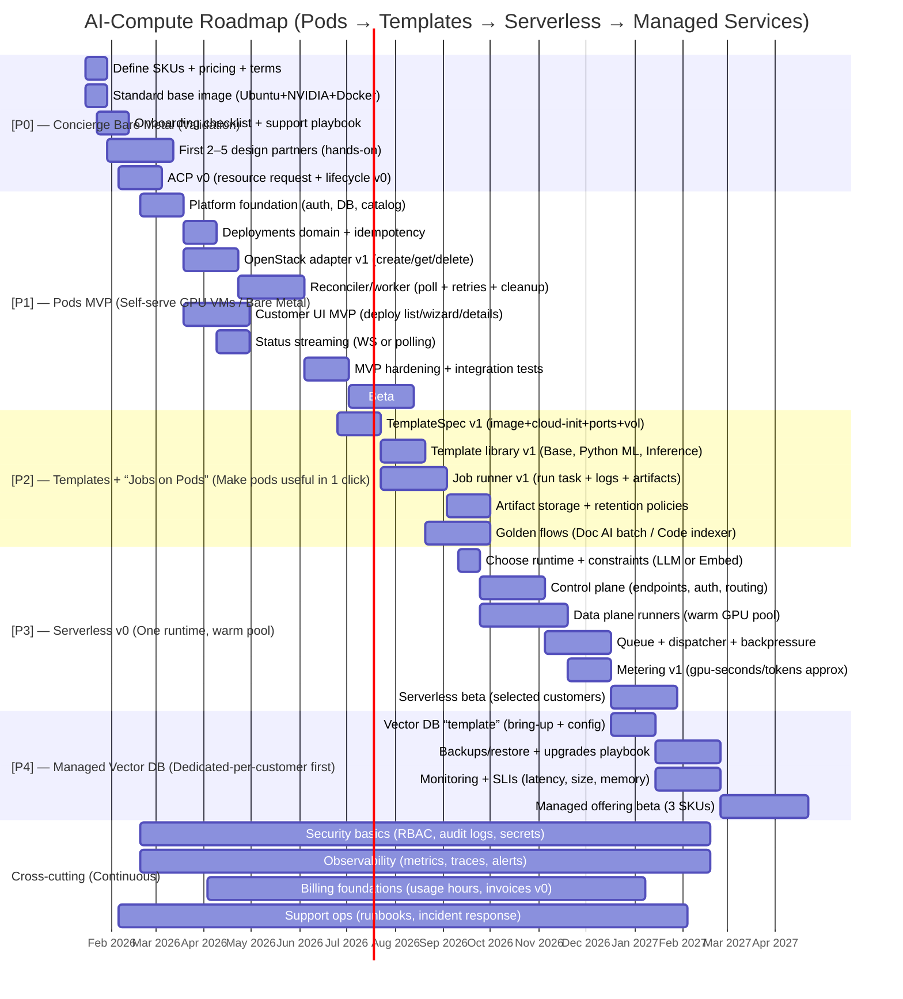

```mermaid
gantt
  title AI-Compute Roadmap (Pods → Templates → Serverless → Managed Services)
  dateFormat  YYYY-MM-DD
  axisFormat  %b %Y

  section [P0] — Concierge Bare Metal (Validation)

  Define SKUs + pricing + terms                :p0a, 2026-01-15, 2w
  Standard base image (Ubuntu+NVIDIA+Docker)   :p0b, 2026-01-15, 2w
  Onboarding checklist + support playbook      :p0c, 2026-01-22, 3w
  First 2–5 design partners (hands-on)         :p0d, 2026-01-29, 6w
  ACP v0 (resource request + lifecycle v0)     :p0e, 2026-02-05, 4w

  section [P1] — Pods MVP (Self-serve GPU VMs / Bare Metal)
  Platform foundation (auth, DB, catalog)      :p1a, 2026-02-19, 4w
  Deployments domain + idempotency             :p1b, after p1a, 3w
  OpenStack adapter v1 (create/get/delete)     :p1c, after p1a, 5w
  Reconciler/worker (poll + retries + cleanup) :p1d, after p1c, 6w
  Customer UI MVP (deploy list/wizard/details) :p1e, after p1a, 6w
  Status streaming (WS or polling)             :p1f, after p1b, 3w
  MVP hardening + integration tests            :p1g, after p1d, 4w
  Beta: onboard 5–10 customers                 :p1h, after p1g, 6w

  section [P2] — Templates + “Jobs on Pods” (Make pods useful in 1 click)
  TemplateSpec v1 (image+cloud-init+ports+vol) :p2a, 2026-06-25, 4w
  Template library v1 (Base, Python ML, Inference) :p2b, after p2a, 4w
  Job runner v1 (run task + logs + artifacts)  :p2c, after p2a, 6w
  Artifact storage + retention policies         :p2d, after p2c, 4w
  Golden flows (Doc AI batch / Code indexer)    :p2e, after p2b, 6w

  section [P3] — Serverless v0 (One runtime, warm pool)
  Choose runtime + constraints (LLM or Embed)   :p3a, 2026-09-10, 2w
  Control plane (endpoints, auth, routing)      :p3b, after p3a, 6w
  Data plane runners (warm GPU pool)            :p3c, after p3a, 8w
  Queue + dispatcher + backpressure             :p3d, after p3b, 6w
  Metering v1 (gpu-seconds/tokens approx)       :p3e, after p3c, 4w
  Serverless beta (selected customers)          :p3f, after p3e, 6w

  section [P4] — Managed Vector DB (Dedicated-per-customer first)
  Vector DB “template” (bring-up + config)      :p4a, 2026-12-17, 4w
  Backups/restore + upgrades playbook           :p4b, after p4a, 6w
  Monitoring + SLIs (latency, size, memory)     :p4c, after p4a, 6w
  Managed offering beta (3 SKUs)                :p4d, after p4b, 8w

  section Cross-cutting (Continuous)
  Security basics (RBAC, audit logs, secrets)   :cc1, 2026-02-19, 52w
  Observability (metrics, traces, alerts)       :cc2, 2026-02-19, 52w
  Billing foundations (usage hours, invoices v0):cc3, 2026-04-03, 40w
  Support ops (runbooks, incident response)     :cc4, 2026-02-05, 52w

```