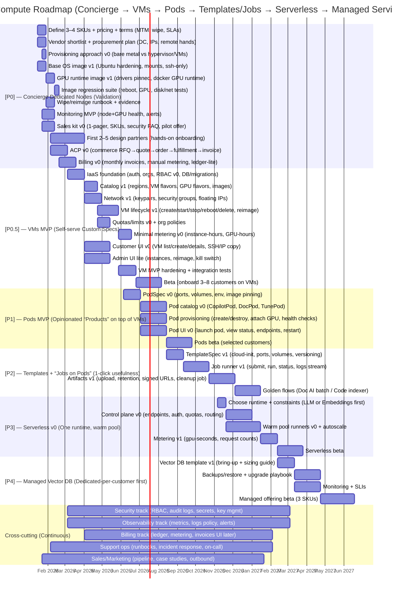

```mermaid
gantt
    title AI-Compute Roadmap (Concierge → VMs → Pods → Templates/Jobs → Serverless → Managed Services)
    dateFormat YYYY-MM-DD
    axisFormat %b %Y

    section [P0] — Concierge Dedicated Nodes (Validation)
        Define 3–4 SKUs + pricing + terms (MTM, wipe, SLAs): p0a, 2026-01-15, 2w
        Vendor shortlist + procurement plan (DC, IPs, remote hands): p0a2, 2026-01-15, 2w
        Provisioning approach v0 (bare metal vs hypervisor/VMs): p0a3, 2026-01-22, 1w
        Base OS image v1 (Ubuntu hardening, mounts, ssh-only): p0b1, 2026-01-15, 2w
        GPU runtime image v1 (drivers pinned, docker GPU runtime): p0b2, after p0b1, 2w
        Image regression suite (reboot, GPU, disk/net tests): p0b3, after p0b2, 1w
        Wipe/reimage runbook + evidence: p0b4, 2026-01-29, 2w
        Monitoring MVP (node+GPU health, alerts): p0c1, 2026-01-22, 3w
        Sales kit v0 (1-pager, SKUs, security FAQ, pilot offer): p0c2, 2026-01-22, 3w
        First 2–5 design partners (hands-on onboarding): p0c3, 2026-02-05, 8w
        ACP v0 (commerce RFQ→quote→order→fulfillment→invoice): p0d1, 2026-02-05, 4w
        Billing v0 (monthly invoices, manual metering, ledger-lite): p0d2, 2026-02-19, 4w

    section [P0.5] — VMs MVP (Self-serve Custom Specs)
        IaaS foundation (auth, orgs, RBAC v0, DB/migrations): p05a, 2026-03-05, 4w
        Catalog v1 (regions, VM flavors, GPU flavors, images): p05b, after p05a, 3w
        Network v1 (keypairs, security groups, floating IPs): p05c, after p05a, 4w
        VM lifecycle v1 (create/start/stop/reboot/delete, reimage): p05d, after p05b, 5w
        Quotas/limits v0 + org policies: p05e, after p05b, 3w
        Minimal metering v0 (instance-hours, GPU-hours): p05f, after p05d, 3w
        Customer UI v0 (VM list/create/details, SSH/IP copy): p05g, after p05a, 6w
        Admin UI lite (instances, reimage, kill switch): p05h, after p05a, 6w
        VM MVP hardening + integration tests: p05i, after p05d, 4w
        Beta (onboard 3–8 customers on VMs): p05j, after p05i, 6w

    section [P1] — Pods MVP (Opinionated “Products” on top of VMs)
        PodSpec v0 (ports, volumes, env, image pinning): p1a, 2026-06-05, 4w
        Pod catalog v0 (CopilotPod, DocPod, TunePod): p1b, after p1a, 6w
        Pod provisioning (create/destroy, attach GPU, health checks): p1c, after p1a, 6w
        Pod UI v0 (launch pod, view status, endpoints, restart): p1d, after p1a, 6w
        Pods beta (selected customers): p1e, after p1c, 6w

    section [P2] — Templates + “Jobs on Pods” (1-click usefulness)
        TemplateSpec v1 (cloud-init, ports, volumes, versioning): p2a, 2026-08-14, 4w
        Job runner v1 (submit, run, status, logs stream): p2b, after p2a, 6w
        Artifacts v1 (upload, retention, signed URLs, cleanup job): p2c, after p2b, 6w
        Golden flows (Doc AI batch / Code indexer): p2d, after p2c, 6w

    section [P3] — Serverless v0 (One runtime, warm pool)
        Choose runtime + constraints (LLM or Embeddings first): p3a, 2026-11-06, 2w
        Control plane v0 (endpoints, auth, quotas, routing): p3b, after p3a, 6w
        Warm pool runners v0 + autoscale: p3c, after p3a, 8w
        Metering v1 (gpu-seconds, request counts): p3d, after p3c, 4w
        Serverless beta: p3e, after p3d, 6w

    section [P4] — Managed Vector DB (Dedicated-per-customer first)
        Vector DB template v1 (bring-up + sizing guide): p4a, 2027-02-12, 4w
        Backups/restore + upgrade playbook: p4b, after p4a, 6w
        Monitoring + SLIs: p4c, after p4a, 6w
        Managed offering beta (3 SKUs): p4d, after p4b, 8w

    section Cross-cutting (Continuous)
        Security track (RBAC, audit logs, secrets, key mgmt): cc1, 2026-03-05, 52w
        Observability track (metrics, logs policy, alerts): cc2, 2026-03-05, 52w
        Billing track (ledger, metering, invoices UI later): cc3, 2026-04-02, 44w
        Support ops (runbooks, incident response, on-call): cc4, 2026-02-05, 52w
        Sales/Marketing (pipeline, case studies, outbound): cc5, 2026-01-22, 52w

```