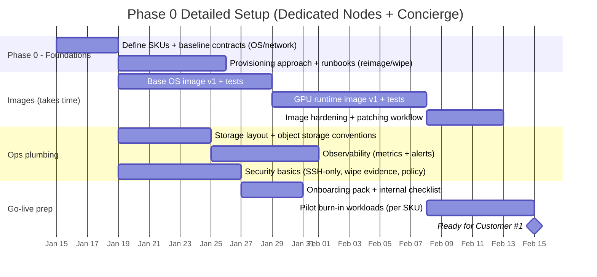

```mermaid
gantt
    title Phase 0 Detailed Setup (Dedicated Nodes + Concierge)
    dateFormat YYYY-MM-DD
    axisFormat %b %d

    section Phase 0 - Foundations
        Define SKUs + baseline contracts (OS/network): p0a, 2026-01-15, 4d
        Provisioning approach + runbooks (reimage/wipe): p0b, after p0a, 7d

    section Images (takes time)
        Base OS image v1 + tests: p0c, after p0a, 10d
        GPU runtime image v1 + tests: p0d, after p0c, 10d
        Image hardening + patching workflow: p0e, after p0d, 5d

    section Ops plumbing
        Storage layout + object storage conventions: p0f, after p0a, 6d
        Observability (metrics + alerts): p0g, after p0f, 7d
        Security basics (SSH-only, wipe evidence, policy): p0h, after p0a, 8d

    section Go-live prep
        Onboarding pack + internal checklist: p0i, after p0h, 4d
        Pilot burn-in workloads (per SKU): p0j, after p0d, 7d
        Ready for Customer #1: milestone, after p0j, 0d

```